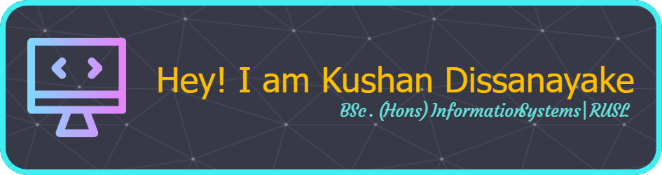

# 💫 About Me:
🔭 I’m currently working as Junior Fullstack Software Developer at Residue Solutions (Pvt) Ltd
 🌱 I’m currently learning Bachelor of Science Honors in Information Systems | RUSL 👨‍💻 All of my projects are available at https://kushandissanayake.netlify.app/ 📫 How to reach me kushandissanayake57@gmail.com

# 💻 Tech Stack:
                                                 
# 📊 GitHub Stats:
 
 

### 🔝 Top Contributed Repo

<h3 align="left">Connect with me:</h3>

